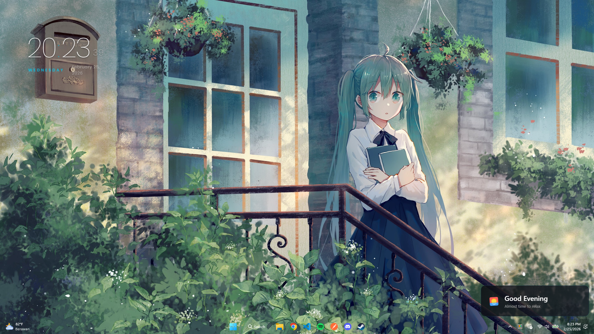

<div align="center">
  
  <h1>NxUI</h1>
  <p><strong>A Next-Generation, Open-Source Desktop Widget Engine</strong></p>
  <p>
    <a href="https://github.com/nexvlif/NxUI/blob/main/DOCUMENTATION.md"><b>Documentation</b></a> •
    <a href="https://github.com/nexvlif/nxui-widgets"><b>Widget Ecosystem</b></a>
  </p>
  <p>
    
    
    
  </p>
  <p><em>Built with Web Technologies, Optimized for the Desktop. Ultra-lightweight & Premium.</em></p>
  <br />
  
</div>

---

## What is NxUI?

NxUI is a premium desktop customization tool that allows you to build, install, and manage lively desktop widgets using the languages you already know: **HTML, CSS, and TypeScript/JavaScript**. 

Unlike legacy software, NxUI leverages modern API bridging and a powerful custom widget lifecycle to give you total control over your desktop layout without the performance penalties typical of Electron apps.

## Features

*   **Global Theme Engine:** A built-in CSS variable orchestrator. Swap your entire desktop's color palette (like our default **Miku Garden**) instantly.
*   **Modern SDK:** Simple, typed, and powerful SDK for widget development.
*   **Visual Edit Mode:** Press `Ctrl + E` to interactively drag and drop widgets. Lock them seamlessly into the background when done.
*   **Real Hardware Data:** Direct access to Node.js `os` metrics for live CPU, RAM, and uptime monitoring.
*   **Hot Reloading:** Widgets live-reload automatically as you edit the source code.
*   **CORS-Free Fetching:** Scrape or hit any external API directly through the main process safely.

## Extreme Performance (No More "Electron is Heavy")

We've specifically tuned the Chromium engine to ensure widgets are practically invisible to your system resources. NxUI is designed for users who want beauty without sacrificing FPS:

-   **Memory Capping:** Hard-limited V8 heap per process (`--max-old-space-size=48`).
-   **Aggressive Throttling:** Background rendering and timers are killed for idle widgets.
-   **Lean Process Footprint:** Disabled heavy features like spellcheck, hardware media keys, and site isolation to save ~40MB of RAM per instance.
-   **Staggered Loading:** Animations and window creation are staggered to prevent CPU spikes.

## Developer Experience (DX)

We believe building widgets should be fun. NxUI provides a streamlined workflow with path aliases and a built-in sandbox.

### Writing Your First Widget

Creating a widget is incredibly easy. Just create a folder in your `widgets` directory:

**`widget.ts`**
```typescript
import { defineWidget } from "@/sdk/define";
import type { WidgetContext } from "@/sdk/types";

export default defineWidget({
  name: "Hello World",
  version: "1.0.0",
  author: "YourName",
  width: 300,
  height: 100,

  onMount(ctx: WidgetContext) {
    ctx.getElementById("title").textContent = "Hello from NxUI!";
  }
});
```

**`template.html`**
```html
<div class="card">
  <h1 id="title">Loading...</h1>
</div>
```

## Getting Started

### Installation
1.  Download the latest installer from the [Releases](https://github.com/nexvlif/NxUI/releases) tab.
2.  Launch NxUI from your System Tray.
3.  Right-click the tray icon to manage your widgets or enter **Edit Mode (Ctrl+E)**.

### Build from Source
```bash
# Clone and install
git clone https://github.com/nexvlif/NxUI.git
npm install

# Run in development mode
npm run dev

# Build production installer
npm run pack
```

## Contribution

NxUI is built for the community. Have a cool widget? Open a Pull Request to our [Widget Ecosystem](https://github.com/nexvlif/nxui-widgets)! We love seeing new clock designs, system monitors, and creative overlays.